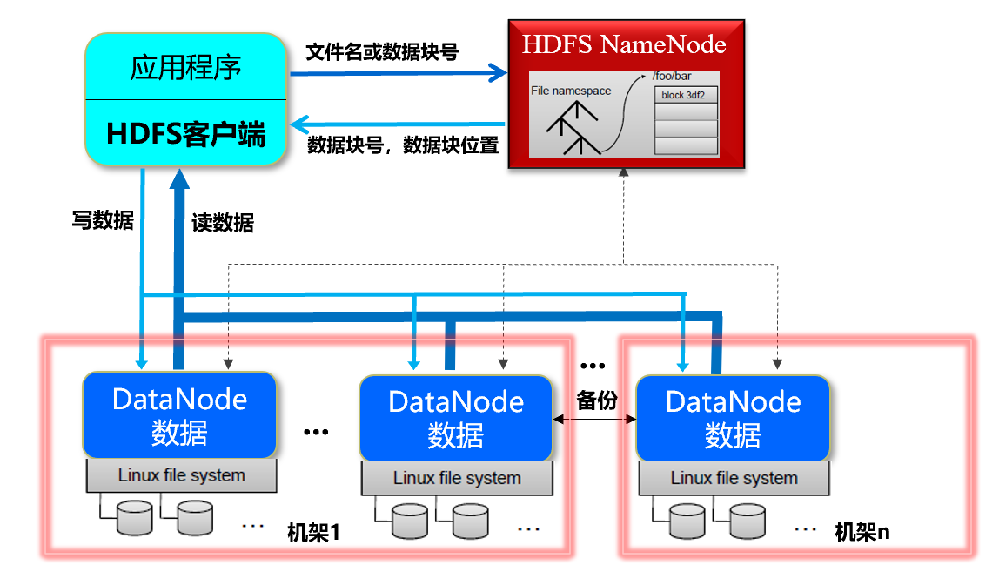

# Task02 详读第3章HDFS内容

## 第三章 Hadoop分布式文件系统

### 1 产生的背景
随着数据量越来越大，一台独立的物理计算机逐渐已经存不下所有的数据。直观的解决办法就是：当一台机器存不下时，那就用上百上千万台机器一起存储大规模的数据，但是管理和维护会极其不方便，十分低效。而这也是大数据时代必须解决的**海量数据的高效存储问题**！！为此，**分布式文件系统**孕育而生！
**分布式文件系统是管理网络中跨多台计算机存储的文件系统**。
谷歌公司开发了**第一个大规模商业化应用的分布式文件系统GFS**，而Hadoop分布式文件系统是针对GFS的开源实现，它就是Hadoop两大核心组成部分之一的**HDFS**！！

### 2 概述
#### 2.1 分布式文件系统简介
普通文件系统和分布式文件系统“块”的概念
- 普通文件系统：一般会把磁盘空间划分为每512字节一组，称为“磁盘块”，它是文件系统读写操作的最小单位，文件系统的块（Block）通常是磁盘块的整数倍，即每次读写的数据量必须是磁盘块大小的整数倍；
- 分布式文件系统：也采用了块的概念，文件被分成若干个块进行存储，块是数据读写的基本单元，只不过分布式文件系统的块要比普通文件系统中的块大很多，比如，HDFS默认的一个块的大小是64MB，而且与普通文件系统不同的是，在分布式文件系统中，如果一个文件小于一个数据块的大小，它不会占用整个数据块的储存空间。设计一个比较大的块，是为了最小化寻址开销（HDFS寻址开销包括：磁盘的寻道开销和数据块的定位开销）；但是块的大小也不能太大，会导致MapReduce中的Map任务一次只处理一个块中的数据，如果启动的任务太少，反而会影响并行的速度。
    - 分布式文件系统的设计一般采用“客户机/服务器”（Client/Server）
    - 分布式文件系统在物理结构上是由计算机集群中的多个节点构成的，这些节点分为两类
        - **主节点/名称节点**：负责文件和目录的创建、删除和重命名等，同时管理着数据节点和文件块的映射关系，因此客户端只有访问名称节点才能找到请求的文件块所在的位置，从而到相应位置读取所需的文件块；
        - **从节点/数据节点**：负责数据的存储和读取。在存储时，由名称节点分配存储位置，然后由客户端把数据直接写入相应数据节点；在读取时，客户端从名称节点获得数据节点和文件块的映射关系，然后就可以到相应位置访问文件块。数据节点也要根据名称节点的命令创建、删除数据块和冗余复制。
    - **高可靠性**：计算机集群中的节点可能发生故障，因此为了保证数据的完整性，分布式文件系统通常采用多副本存储。

#### 2.2 HDFS简介
**HDFS**(Hadoop Distribute File System)是大数据领域一种非常可靠的存储系统。

具有以下特性：
- 兼容廉价的硬件设备：实现在硬件故障的情况下也能保障数据的完整性
- 流数据读写：不支持随机读写的操作
- 大数据集：数据量一般在GB、TB以上的级别
- 简单的文件模型：一次写入、多次读取
- 强大的跨平台兼容性：采用`Java`语言实现

但是，HDFS也有如下局限性：
- 不适合低延迟数据访问
- 无法高效存储大量小文件
- 不支持多用户写入及任意修改文件

### 3 HDFS的体系结构
HDFS采用了主从（Master/Slave）结构模型，一个HDFS集群包括一个名称节点（NameNode）和若干个数据节点（DataNode）。

- **名称节点**作为中心服务器，负责管理文件系统的命名空间及客户端对文件的访问。
- **数据节点**负责处理文件系统客户端的读/写请求，在名称节点的统一调度下进行数据块的创建、删除和复制等操作。
- 每个数据节点会周期性地向名称节点发送**心跳信息**，报告自己的状态，没有按时发送心跳信息的数据节点会被标记为“宕机”，不会再给它分配任何I/O请求。

### 4 HDFS的存储原理
#### 4.1 数据的冗余存储
为了保证系统的容错性和可用性，HDFS采用了多副本方式对数据进行冗余存储，通常一个数据块的多个副本会被分布到不同的数据节点上。

这种多副本方式具有以下 3 个优点：
- **加快数据传输速度**：当多个客户端需要同时访问同一个文件时，可以让各个客户端分别从不同的数据块副本中读取数据，这就大大加快了数据传输速度，实现了并行操作。
- **容易检查数据错误**：HDFS的数据节点之间通过网络传输数据，采用多个副本可以很容易判断数据传输是否出错。
- **保证数据的可靠性**：即使某个数据节点出现故障失效，也不会造成数据丢失。

#### 4.2 数据存取策略
- 数据存放

    HDFS采用了以机架（Rack）为基础的数据存放策略。一个HDFS集群通常包含多个机架，不同机架之间的数据通信需要经过交换机或路由器，同一机架的不同机器之间数据通信不需要交换机或路由器，因此同一机架中不同机器之间的通信要比不同机架之间机器的通信带宽大。

    - 优点：
        - 可以获得很高的数据可靠性，即使一个机架发生故障，位于其他机架上的数据副本仍然可用。
        - 在读数据的时候，可以在多个机架上并行读取数据，大大提高了数据读取速度。
        - 可以更容易实现系统内部负载均衡和错误纠正。

    - 缺点：写入数据的时候不能充分利用同一机架内部机器之间的带宽。
- 数据读取

    HDFS提供了一个API，用于确定一个数据节点所属的机架的ID，客户端可以调用该API获取自己所属机架的ID。

    当客户端读取数据时，从名称节点获取数据块不同副本的存放位置的列表，列表中包含了副本所在的数据节点，可以调用API确定客户端和这些数据节点所属的机架ID。当发现某个数据块副本对应的机架ID和客户端对应的机架的ID相同时，则优先选择该副本读取数据；如果没有发现，则随机选择一个副本读取数据。
- 数据复制

    HDFS的数据复制采用了 **流水线复制** 的策略，大大提高了数据复制过程的效率。

### 5 任务小结
本次任务，主要学习了HDFS的相关特性，以及HDFS相关命令。