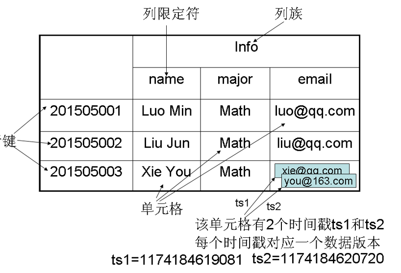
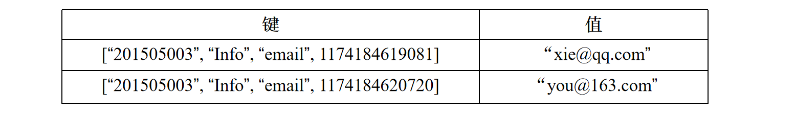
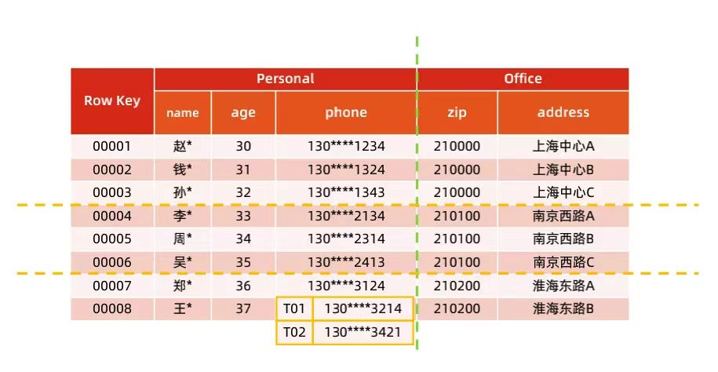
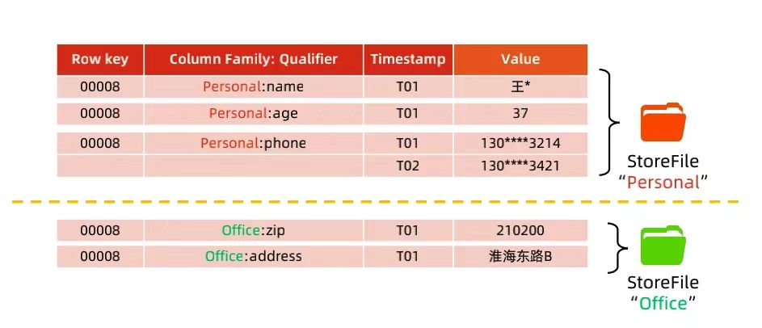

# Task03 详读第4章HBase内容

## 第三章 HBase

### 1 HBase VS 传统数据库
&emsp;&emsp;首先，我们来了解一下数据结构的分类：  
- **结构化数据**：即以关系型数据库表形式管理的数据；
- **半结构化数据**：具有非关系模型、基本固定结构模式的数据，例如日志文件、XML文档、JSON文档、Email等；
- **非结构化数据**：没有固定模式的数据，如Word、PDF、PPT、Excel、各种格式的图片、视频等。

&emsp;&emsp;为了存储不同的数据结构，也诞生了众多类型的数据库：
- **关系型数据库**：关系型数据库模型，是把复杂的数据结构归结为简单的二元关系（即二维表格形式）。
  - 代表软件：**MySQL**

- **键值存储数据库**：键值数据库是一种非关系数据库，它使用简单的键值方法来存储数据。键值数据库将数据存储为键值对集合，其中键作为唯一标识符。
  - 代表软件：**Redis**

- **列存储数据库**：列式存储（column-based）是相对于传统关系型数据库的行式存储（Row-basedstorage）来说的。简单来说，两者的区别就是对表中数据的存储形式的差异。
  - 代表软件：**HBase**

- **面向文档数据库**：此类数据库可存放并获取文档，可以是XML、JSON、BSON等格式，这些文档具备可描述性（self-describing），呈现分层的树状结构（hierarchical tree data structure），可以包含映射表、集合和纯量值。数据库中的文档彼此相似，但不必完全相同。文档数据库所存放的文档，就相当于键值数据库所存放的“值”。文档数据库可视为其值可查的键值数据库。
  - 代表软件：**MongoDB**

- **图形数据库**：图形数据库顾名思义，就是一种存储图形关系的数据库。图形数据库是[NoSQL数据库](https://blog.csdn.net/qq_14927217/article/details/73835463)的一种类型，可以用于存储实体之间的关系信息。最常见例子就是社会网络中人与人之间的关系。
  - 代表软件：**Neo4J**、ArangoDB、OrientDB、FlockDB、GraphDB、InfiniteGraph、Titan和Cayley等
  
- **搜索引擎数据库**：搜索引擎数据库是一类专门用于数据内容搜索的非关系数据库。搜索引擎数据库使用索引对数据中的相似特征进行归类，并提高搜索能力。搜索引擎数据库经过优化，以处理可能内容很长的半结构化或非结构化数据，它们通常提供专业的方法，例如全文搜索、复杂搜索表达式和搜索结果排名等。 
  - 代表软件：**Solr**、**Elasticsearch**等

&emsp;&emsp;HBase与传统的关系型数据库的区别主要在于：  
- **数据类型**：关系型数据库数据类型较为丰富，数据类型有`int`、`date`、`long`等。Hbase数据类型简单，每个数据都被存储为未经解释的字符串，用户需要自己编写程序把字符串解析成不同的数据类型。
- **数据操作**：关系型数据库存在增删改查，还有我们比较熟悉的联表操作，效率较低。Hbase不会把数据进行充分的规范化。很多数据是存在一张表里，避免了低效率的连接操作。
- **存储模式**：关系型数据库采用行模式存储，Hbase是基于列存储。
- **数据索引**：关系型数据库可以对不同的列构建复杂的索引结构。Hbase支持对行键的索引。
- **数据维护**：更新操作时，关系型数据库会把数据替换掉，Hbase会保留旧的版本数据一段时间，到了一定期限才会在后台清理数据。
- **可伸缩性**：关系型数据库很难实现水平扩展，Hbase采用分布式集群存储，水平扩展性较好

&emsp;&emsp;但是相比于关系型数据库，HBase也有自身的局限，由于其不支持事务，因此无法实现跨行的原子性。

### 2 HBase 简介

&emsp;&emsp;HBase是构建在Hadoop文件系统之上的一个**高可靠、高性能、面向列、可伸缩**的**分布式数据库**，主要用来存储**非结构化**和**半结构化**的松散数据。它是谷歌 BigTable 的开源实现，可以通过水平扩展的方式，利用廉价计算机集群处理由超过10亿行数据和数百万列元素组成的数据表。  
&emsp;&emsp;HBase旨在提供对大量结构化数据的快速随机访问。它利用Hadoop文件系统（HDFS）提供的容错功能，同时作为Hadoop生态系统的一部分，提供对Hadoop文件系统中的数据的随机**实时**读写访问。  
&emsp;&emsp;在Hadoop生态系统中，HBase利用Hadoop MapReduce来处理HBase中的海量数据，实现高性能计算；利用ZooKeeper作为协同服务，实现稳定服务和失败恢复；使用HDFS作为高可靠的底层存储，利用廉价集群提供海量数据存储能力。（当然，HBase也可以直接使用本地文件系统而不用HDFS作为底层数据存储方式。）Sqoop为HBase提供了高效、便捷的RDBMS数据导入功能，Pig和Hive为HBase提供了高层语言支持。

### 3 数据模型概述

- HBase是一个稀疏、多维度、排序的映射表，这张表的**索引**是**行键、列族、列限定符和时间戳**。
- 每个值是一个未经解释的字符串，没有数据类型。
- 用户在表中存储数据，每一行都有一个可排序的行键和任意多的列。
- 表在水平方向由一个或者多个列族组成，一个列族中可以包含任意多个列，**同一个列族里面的数据存储在一起**。
- 列族支持动态扩展，可以很轻松地添加一个列族或列，无需预先定义列的数量以及类型，所有列均以字符串形式存储。因此对于整个映射表的每行数据而言，有些列的值是空的，所以说HBase是稀疏的。
- HBase中执行**更新**操作时，并不会删除数据旧的版本，而是**生成一个新的版本**，旧有的版本仍然保留（这是和HDFS只允许追加不允许修改的特性相关的）。

### 4 数据模型的相关概念

- **表**：HBase采用表来组织数据，表由行和列组成，列划分为若干个列族。
- **行**：每个HBase表都由若干行组成，每个行由行键（row key）来标识。
- **列族**：一个HBase表被分组成许多“列族”（Column Family）的集合，它是基本的访问控制单元。表中的每个列都归属于某个列族，数据可以被存放到列族的某个列下面（列族需要先创建好）。在创建完列族以后，就可以使用同一个列族当中的列。列名都以列族作为前缀。例如，`courses:history`和`courses:math`这两个列都属于`courses`这个列族。
- **列限定符**：列族里的数据通过列限定符（或列）来定位。
- **单元格**：在HBase表中，通过行、列族和列限定符确定一个“单元格”（cell），单元格中存储的数据没有数据类型，总被视为字节数组`byte[]`。
- **时间戳**：每个单元格都保存着同一份数据的多个版本，这些版本采用时间戳进行索引。

&emsp;&emsp;下面用一个示例为阐释HBase的数据模型，下图为一张用来存储学生信息的HBase表：

&emsp;&emsp;学号作为行键来唯一标识每个学生，表中设计了列族`Info`来保存学生相关信息，列族`Info`中包含3个列——`name`、`major`和`email`，分别用来保存学生的姓名、专业和电子邮件信息。  
&emsp;&emsp;学号为`201505003`的学生存在两个版本的电子邮件地址，时间戳分别为`ts1=1174184619081`和`ts2=1174184620720`，时间戳较大的版本的数据是最新的数据。

### 5 数据坐标

&emsp;&emsp;HBase使用坐标来定位表中的数据，也就是说，每个值都通过坐标来访问。HBase中需要根据行键、列族、列限定符和时间戳来确定一个单元格，因此，可以视为一个“四维坐标”，即 `[行键, 列族, 列限定符, 时间戳]`。  
&emsp;&emsp;如果把所有坐标看成一个整体，视为“键”，把四维坐标对应的单元格中的数据视为“值”，那么，HBase可以看成一个键值数据库。

### 6 概念视图

### 7 物理视图

### 8 面向列的存储

&emsp;&emsp;我们通过一个简单例子，看看列式存储与行式存储方式的具体差别。

1. **传统行式数据库**  
- 数据是按行存储的
- 没有索引的查询使用大量I/O。在从磁盘中读取数据时，需要从磁盘中顺序扫描每个元组的完整内容，然后从每个元组中筛选出查询所需要的属性
- 建立索引和物理视图需要花费大量时间和资源
- 面对查询的需求，数据库必须被大量膨胀才能满足性能要求

2. **列式数据库**  
- 数据按列存储，每一列单独存放
- 数据即是索引
- 只访问查询涉及的列，大量降低系统IO
- 每一列由一个线索来处理，查询采用并发处理方式
- 数据类型一致，数据特征相似，采用高效压缩方式
- 缺陷：执行链接操作时，需要昂贵的元组重构代价

### 9 任务小结
本次任务学习了HBase的原理以及特性，并且通过实验对HBase有了更深的认识，自己也在docker上搭建了HBase数据库。