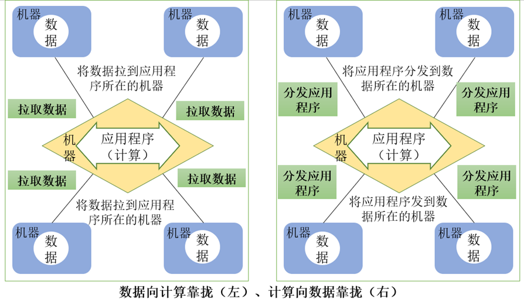
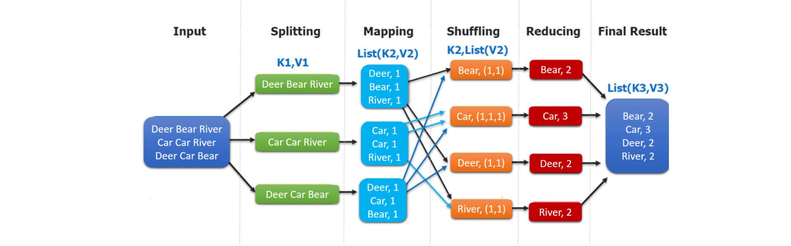

# Task04 详读第5章Mapreduce内容

## 1 MapReduce模型简介

&emsp;&emsp;MapReduce将复杂的、运行于大规模集群上的并行计算过程高度抽象到了两个函数：`Map`和`Reduce`，这两个函数及其核心思想都源自函数式编程语言。  
&emsp;&emsp;MapReduce设计的一个理念就是**“计算向数据靠拢”**，而不是“数据向计算靠拢"，因为数据需要**大量的网络传输开销**，尤其是在大规模数据环境下，这种开销尤为惊人，所以，移动计算要比移动数据更加经济。在这种理念下，只要有可能，一个集群中的**MapReduce框架就会将Map程序就近地在HDFS数据所在的节点运行，即将计算节点和存储节点放在一起运行，从而减少了节点间的数据移动开销。**

&emsp;&emsp;MapReduce框架采用了Master/Slave架构，包括一个Master和若干个Slave，**Master**上运行**JobTracker**，**Slave**上运行 **TaskTracker**。用户提交的每个计算作业，会被划分成若干个任务。  

- `JobTracker`负责作业和任务的调度，监控它们的执行，并重新调度已经失败的任务。
- `TaskTracker`负责执行由`JobTracker`指派的任务。

&emsp;&emsp;MapReduce是Hadoop中一个批量计算的框架，在整个MapReduce作业的过程中，包括**从数据的输入、数据的处理、数据的输出**这些部分，而其中数据的处理部分就由**map、reduce、combiner**等操作组成。在一个MapReduce的作业中必定会涉及到如下一些组件：
-  客户端：提交MapReduce作业
-  yarn资源管理器：负责集群上计算资源的协调
-  yarn节点管理器：负责启动和监控集群中机器上的计算容器（container）
-  MapReduce的`application master`：负责协调运行MapReduce的作业
-  HDFS：分布式文件系统，负责与其他实体共享作业文件

## 2 Map和Reduce函数

&emsp;&emsp;MapReduce模型的核心是Map函数和Reduce函数，二者都是由应用程序开发者负责具体实现的。  
&emsp;&emsp;Map函数和Reduce函数都是以<key, value>作为输入，按一定的映射规则转换成另一个或一批<key, value>进行输出。  

|  函数  |              输入              |           输出            |                             说明                             |
| :----- | :----------------------------- | :------------------------ | :----------------------------------------------------------- |
|  Map   |   <k1,v1> 如：<行号,”a b c”>   | List(<k2,v2>) 如：<“a”,1> | 1、将小数据集进一步解析成一批<key,value>对，输入Map函数中进行处理 2、每一个输入的<k1,v1>会输出一批<k2,v2>。<k2,v2>是计算的中间结果 |
| Reduce | <k2,List(v2)> 如：<“a”,<1,1,1>> |    <k3,v3> 如：<“a”,3>    | 输入的中间结果<k2,List(v2)>中的List(v2)表示是一批属于同一个k2的value |

## 3 MapReduce工作流程概述

&emsp;&emsp;大规模数据集的处理包括**分布式存储**和**分布式计算**两个核心环节。谷歌公司用分布式文件系统GFS实现分布式数据存储，用MapReduce实现分布式计算，而Hadoop则使用分布式文件系统HDFS实现分布式数据存储，用Hadoop MapReduce实现分布式计算。MapReduce的输入和输出都需要借助于分布式文件系统进行存储，这些文件被分布存储到集群中的多个节点上。  
&emsp;&emsp;MapReduce的核心思想可以用**分而治之**来描述，即把一个大的数据集拆分成多个小数据块在多台机器上并行处理，也就是说，一个大的MapReduce作业的处理流程如下：  
&emsp;&emsp;**首先会被拆分成许多个Map任务在多台机器上并行执行，**每个`Map`任务通常运行在数据存储的节点上，这样，计算和数据就可以放在一起运行，不需要额外的数据传输开销。当`Map`任务结束后，会生成以`<key,value>`形式表示的许多中间结果。  
&emsp;&emsp;然后，这些中间结果会被分发到多个`Reduce`任务在多台机器上**并行执行**，**具有相同key**的`<key,value>`会被发送到同一个`Reduce`任务那里，`Reduce`任务会对中间结果进行汇总计算得到最后结果，并输出到分布式文件系统中。

> &emsp;&emsp;不同的Map任务之间不会进行通信，不同的Reduce任务之间也不会发生任何信息交换；用户不能显式地从一台机器向另一台继机器发送消息，所有的数据交换都是通过MapReduce框架自身去实现的。  
> &emsp;&emsp;在MapReduce的整个执行过程中，**Map任务的输入文件、Reduce任务的处理结果**都是保存在**分布式文件系统**中的，而**Map任务**处理得到的**中间结果**则保存在**本地存储**（如磁盘）中。

## 4 任务小结
&emsp;&emsp;本次任务学习了MapReduce的具体流程，以及Shuffle过程，并且通过WordCount实验，对MapReduce的计算流程有了更近一步的理解。